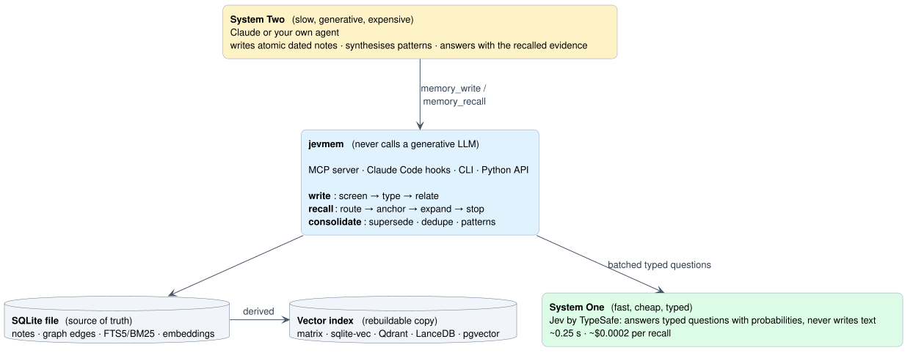
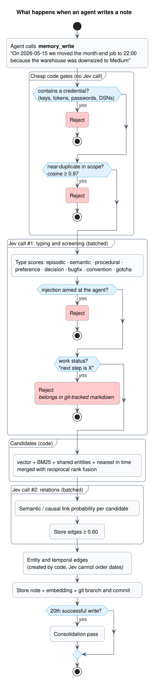
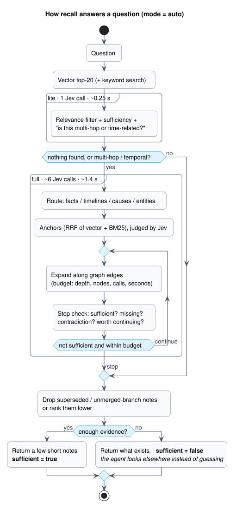
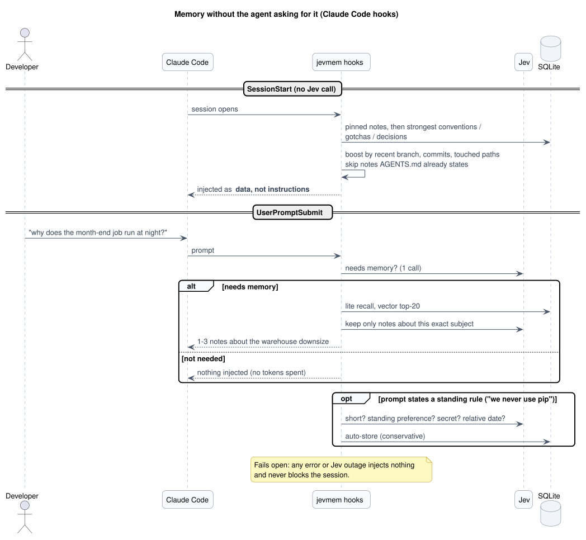
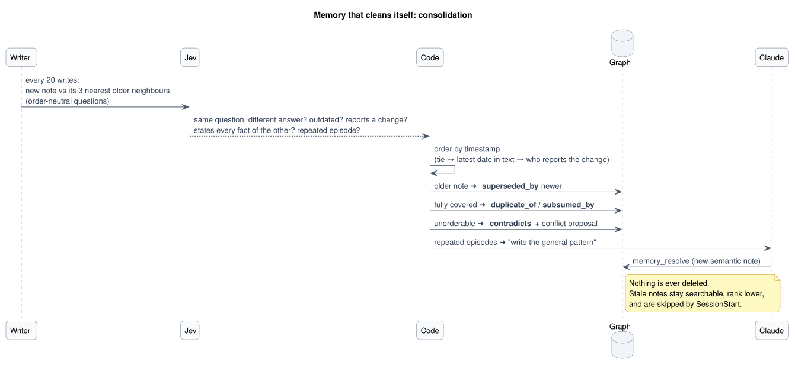
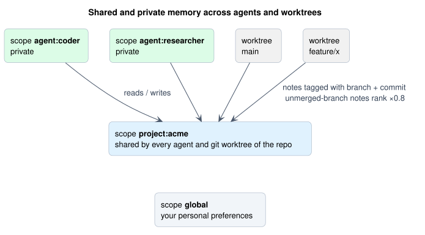

# Architecture

The technical tour: what runs when an agent writes, recalls, starts a session, or lets memory age. For the ideas
behind it (Jev, embeddings, vector indexes) read [concepts.md](concepts.md); for measurements read
[evaluation.md](evaluation.md).



The design rule is a split of labour taken from the [Jev-Mem paper](https://arxiv.org/abs/2609.23986): every
**control decision** (is this safe, what kind of note is it, does it conflict with another, which notes matter, do I
have enough) is a typed probability from **Jev**, batched into as few calls as possible. Everything **generative**
(writing the note, synthesising a pattern, answering) belongs to the host agent. jevmem never calls a generative LLM,
and thresholds live in code (`Config`), tuned on data, never inside prompts.

## Write path (`write.py`)



1. Cheap code gates first: secrets and near-duplicates are rejected without spending a Jev call.
2. One batched Jev call types the note (episodic, semantic, procedural, preference, decision, bugfix, convention,
   gotcha) and scores **injection** and **status**. Injection means text aimed at the agent itself; ordinary team
   rules ("never use pip") must pass. Status means "what is in progress / next", which goes stale silently and belongs
   in a git-tracked markdown file.
3. Candidate neighbours come from code: vector + BM25 + shared entities + nearest in time, merged with reciprocal rank
   fusion (RRF).
4. A second batched call scores semantic and causal relations for each candidate; edges are stored at >= 0.60. Entity
   and temporal edges are created by code, because Jev cannot order dates.
5. The note is stored with its embedding and the git branch and commit it was written on.
6. If Jev is down, the write is queued as `pending` ("unscreened", invisible to recall) and flushed later.

## Recall path (`retrieve.py`)



| mode | what it does | cost | use it for |
|---|---|---|---|
| `lite` | vector top-20, one Jev call that filters relevance, judges sufficiency and flags multi-hop/temporal | 1 call, ~0.25 s | hooks, latency-sensitive paths |
| `full` | route, anchors (RRF), per-anchor relevance, graph expansion under a budget, stop check each round | ~6 calls, ~1.4 s | multi-hop and temporal questions, "does memory know?" |
| `auto` (default) | lite first, escalate to full when lite finds nothing or says multi-hop (>= 0.6) / temporal (>= 0.8) | ~40% fewer Jev tokens than full at equal recall | everything else |

Hard limits (`Config`): depth, nodes, `max_jev_calls` (19, a true cap) and seconds. The result carries `sufficient` and
`missing` flags so the agent can look elsewhere (the code, the web) instead of guessing; unanswerable questions are
abstained on 94-98% of the time. Superseded notes are marked in the evidence Jev sees and ignored by the contradiction
check. The paper's stop thresholds did not fit our wording; defaults are sufficient >= 0.5, missing < 0.6,
contradiction < 0.6.

## Hooks (`hooks.py`)



Both hooks fail open: any error injects nothing, and a transient Jev outage never blocks the session. Configuration
problems (wrong embedder, bad key) surface as a `systemMessage`. Details of each hook are in
[installation.md](installation.md#5-skill-and-hooks).

SessionStart ranks pinned notes first, then by type confidence boosted by similarity to the repository's recent work
(branch, last commits, touched paths) and by how often the prompt hook found a note useful. Notes that restate
`CLAUDE.md`/`AGENTS.md` are skipped: by embedding similarity >= 0.82, and in the 0.70-0.82 band by one cached Jev
coverage call.

## Consolidation (`consolidate.py`)



Every 20 successful writes (inline, ~3-5 s) Jev compares recent notes with their 3 nearest older neighbours. The
questions are order-neutral, because the note written last is not always the newer fact (imports and backfills arrive
late): same question with a different answer? does one outdate the other? does either report that what the other
says has changed (renamed, replaced, moved)? does either state every fact of the other? repeated episodes of one
pattern? worth linking?

Nothing is deleted or generated. Results only annotate the graph:
- a conflict between notes with different timestamps flags the older one `superseded_by` the newer; the order is
  decided in code from timestamps, falling back to write time, and for equal timestamps to the latest date each note
  mentions or to which note reports the change. A conflict nothing can order flags both `contradicts` and becomes a
  `conflict` proposal for the agent;
- a note that says nothing the other does not is flagged `duplicate_of` / `subsumed_by`, with no agent work;
- superseded, duplicate and subsumed notes stay searchable but rank lower and are skipped by SessionStart;
- only repeated episodes become proposals: the host agent writes the general pattern (`memory_pending_synthesis` ->
  `memory_resolve`);
- pairs that recall returned together are queued after each recall and judged on the next pass, so a stale note is
  compared with the notes it actually competes with.

After upgrading, run `jevmem consolidate --all` (or `memory_consolidate(all_notes=True)`) once to re-judge older
notes. Measured on labelled pairs in both write orders: 44/44 held-out cases right versus 22/44 before, 32/32 on a
second held-out set of reworded renames, with no false flags
([evaluation.md](evaluation.md#consolidation)).

## Scopes, worktrees and branches (`gitctx.py`)



Scopes partition memory: `global`, `project:<name>`, `agent:<name>`. Every search is scope-filtered, and always includes `global`. The MCP server and the hooks default to
`project:<repository name>`, shared by all git worktrees of a repository; an agent writes `scope="global"` for
preferences that apply in every project, and recall takes `scope="all"` to search every project. Notes are tagged with the branch and commit
they were written on; notes from a branch that is neither current, default nor merged rank x0.8 lower and the prompt
hook skips them. `jevmem forget --branch <name>` removes the notes of a dead branch.

## Storage

One SQLite file (`~/.jevmem/memory.db`) holds notes, edges, an FTS5 index, entity lookup, flags and queues; the vector
index is a derived, rebuildable copy. The tables and the index comparison are in [concepts.md](concepts.md#4-where-memory-is-stored).

## Using it from your own Python agents

```python
from jevmem import Judge, Service
from jevmem.decider import JevDecider

svc = Service()                       # memory: svc.writer.write(...), svc.retriever.recall(...)
judge = Judge(svc.decider)            # cheap typed decisions, one batched Jev call each
r = judge.route(task, {"coder": "writes code", "researcher": "looks things up"})
if not r.confident: ...               # includes an "unclear" escape option -> hand to an LLM
keep = judge.filter_relevant(goal, tool_output_lines)   # prune before spending LLM tokens
ok, p = judge.screen(untrusted_text)  # injection screen before text enters context or memory
if judge.should_stop(goal, evidence).stop: ...
scores = judge.check(output, {"cites": "cites a source"})  # guardrail; thresholds stay in your code
```
Runnable demo (route / screen / filter / shared memory / stop): `uv run python examples/multi_agent.py`.
Agents share memory through scopes: a shared `project:<name>` plus private `agent:<name>`.

## Code layout
```
src/jevmem/
  decider.py     Decider protocol, JevDecider (typesafe-sdk), FakeDecider
  questions.py   every Noul/Choice question template
  store.py       SQLite nodes/edges + FTS5 + embeddings
  vectorindex.py pluggable vector search (matrix, sqlite-vec, qdrant, lancedb, pgvector)
  write.py       screen -> type -> candidates -> relations
  retrieve.py    route -> anchors -> budgeted expansion -> stop
  consolidate.py periodic redundancy/contradiction/obsolescence pass + synthesis queue
  evalharness.py `jevmem eval` / `eval-injection`: baselines, ablation, sweep, screen accuracy
  decide.py      Judge: route/filter/stop/check/screen for agent apps
  gitctx.py      branch, commit and worktree-shared project name
  service.py     shared wiring (db path, env)
  user_config.py ~/.jevmem/config.jsonc: key, db, model (environment wins)
  mcp_server.py  MCP tools
  cli.py         jevmem command
  hooks.py       SessionStart / UserPromptSubmit logic
```

## Regenerating the diagrams
Sources are PlantUML files in `docs/diagrams/`; the SVGs in `docs/img/` are generated. With Java and Graphviz installed:
```bash
curl -L -o plantuml.jar https://github.com/plantuml/plantuml/releases/latest/download/plantuml.jar
PLANTUML_JAR=plantuml.jar docs/diagrams/render.sh
```
